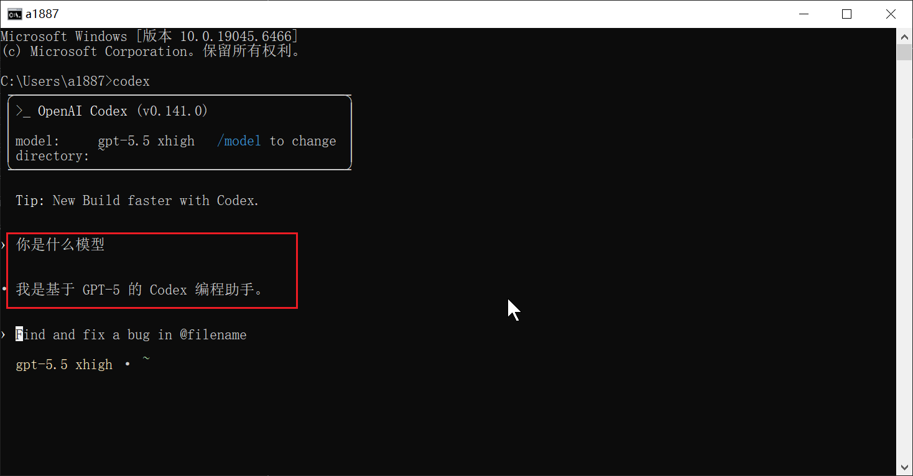
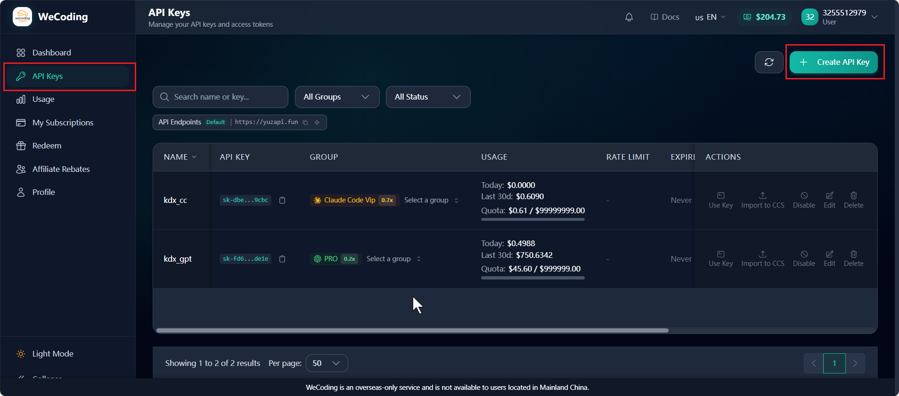
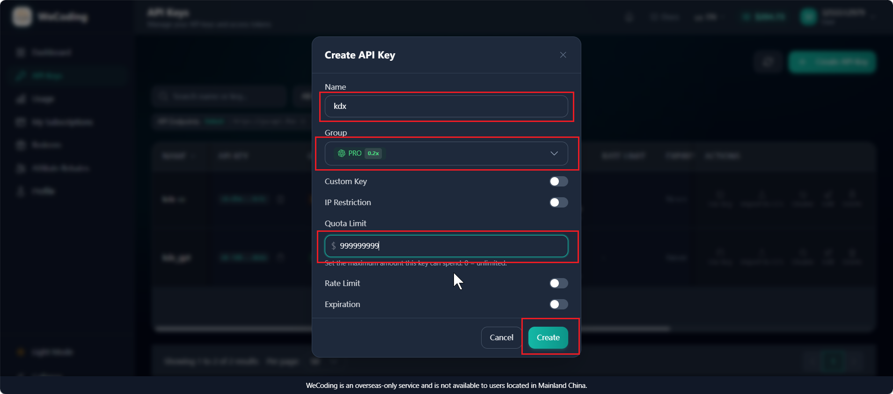
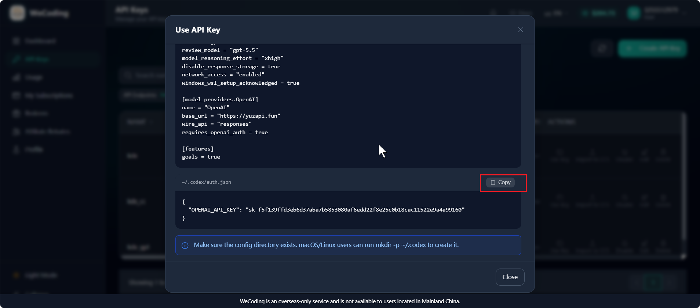
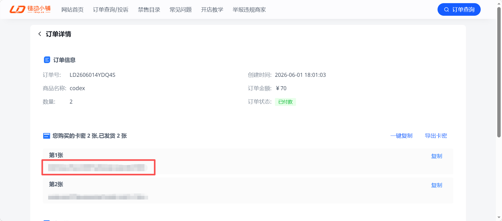
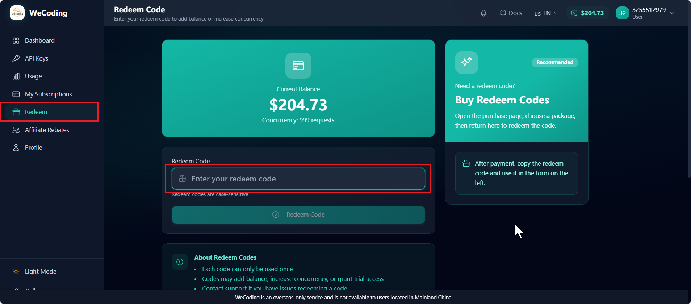

# Windows 下 Codex 安装、配置与使用指南

## 一、前置准备

1. 安装Node.js：去Node.js官网（https://nodejs.org/zh-cn/download）下载 Windows x64版本并安装（.msi 格式）。

2. 检查Node.js是否安装成功：打开 PowerShell 或 CMD，执行下面其中的一个命令，如果能输出版本号，说明 Node.js 和 npm 已经可用。

   ```bash
    node -v # 输出 Node.js 版本，如 v22.2.0 
    npm -v # 输出 npm 版本，如 v10.7.0
   ```

## 二、安装 Codex CLI

1. 安装Codex CLI：以管理员身份打开 PowerShell 或 CMD，执行下面其中的一个 npm 包的全局安装命令：

   ```bash
   npm install -g @openai/codex
   npm install -g @openai/codex --registry=https://registry.npmmirror.com
   ```


2. 检查Codex CLI是否安装成功：安装完成后，重新打开终端执行下面的命令，如果能输出版本号，说明 Codex CLI 安装成功。

   ```bash
   codex --version # 检验Codex CLI 是否安装成功
   ```

## 三、安装桌面版codex

1. 安装桌面版codex：在Microsoft Store里面直接下载安装。（注：桌面版codex看自己需要可装可不装，如果不喜欢命令行的黑窗口就装）

## 四、安装插件版codex

1. 安装插件版codex：先安装vscode，然后在vscode里面装Codex – OpenAI’s coding agent插件。（注：插件版codex看自己需要可装可不装）

## 五、API Key授权与配置

Codex 安装完成后，还需要完成账号授权或 API Key 配置，才能正常使用，这里我们用【方式二：API Key 配置】。

| 方式                     | 适合人群                                   | 配置特点                                   |
| ------------------------ | ------------------------------------------ | ------------------------------------------ |
| 方式一：ChatGPT 账号授权 | 已有 ChatGPT Plus、Pro、Team 等账号的用户  | 通过浏览器登录授权，流程更接近官方默认体验 |
| 方式二：API Key 配置     | 没有 ChatGPT 订阅、希望使用 API Key 的用户 | 需要手动维护 `.codex` 目录中的配置文件     |

### 方式一：ChatGPT 账号授权

1. 在终端中执行：

   ```bash
   codex login
   ```


2. 按终端提示打开浏览器，完成 ChatGPT 登录和授权。成功后返回终端，看到登录成功提示即可。之后可用下面命令查看当前认证状态：

   ```bash
   codex login status
   ```

### 方式二：API Key 配置

1. 获取API Key：具体看【六、API Key获取】。

2. 寻找 .codex 文件夹：打开文件资源管理器，进入用户目录（路径：C:\Users\你的用户名），开启「显示隐藏的项目」（顶部「查看」选项卡勾选），找到 .codex 文件夹。

3. 在 .codex 文件夹中，手动创建两个文件：auth.json 和 config.toml

4. 配置 auth.json 文件（存储 API Key）： 用记事本或 VS Code 打开 auth.json，粘贴以下内容，将 sk-xxx 替换为你获取到的实际 API Key，具体看【六、API Key获取】：

   ```bash
   {"OPENAI_API_KEY": "sk-xxx"}
   ```


5. 配置 config.toml 文件（配置模型和中转地址）： 用记事本或 VS Code 打开 config.toml，粘贴以下内容（直接复制即可）。

   ```bash
   model_provider = "OpenAI"
   model = "gpt-5.5"
   review_model = "gpt-5.5"
   model_reasoning_effort = "xhigh"
   disable_response_storage = true
   network_access = "enabled"
   windows_wsl_setup_acknowledged = true

   [model_providers.OpenAI]
   name = "OpenAI"
   base_url = "https://yuzapi.fun"
   wire_api = "responses"
   requires_openai_auth = true

   [features]
   goals = true
   ```


6. 验证API Key 配置是否成功：重启PowerShell 或 CMD，再执行下面的命令，如果能进入下面的 Codex 交互界面，说明配置已经成功！已经成功！已经成功！

   ```bash
   codex
   ```

   

## 六、API Key获取

1. 获取API Key：注册帐号获取API Key（https://yuzapi.fun/register?aff=CVAYSV57LVMK），配置到 auth.json里。

   

   

   

2. 帐号充值并用卡密兑换（https://pay.ldxp.cn/shop/O6E79ERA）。

   

   

   ​


