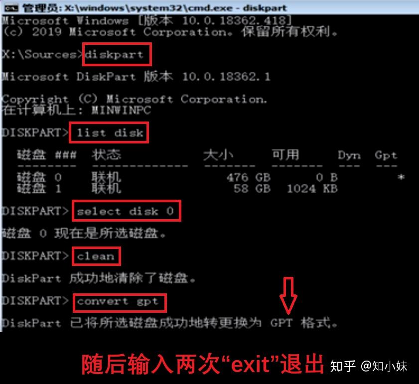
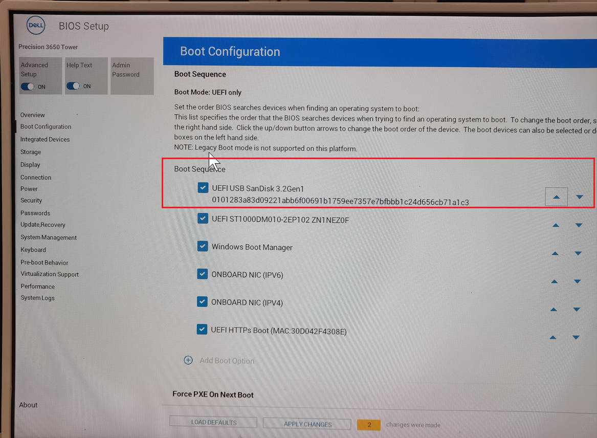
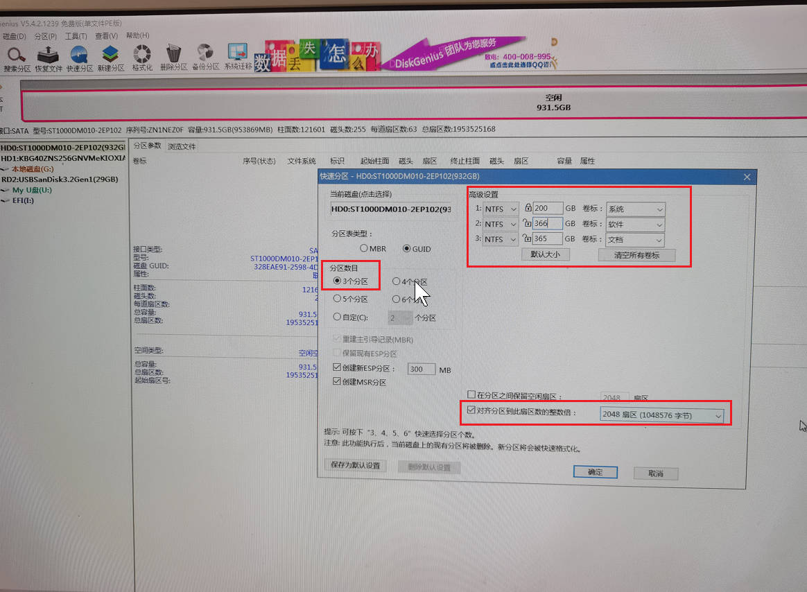
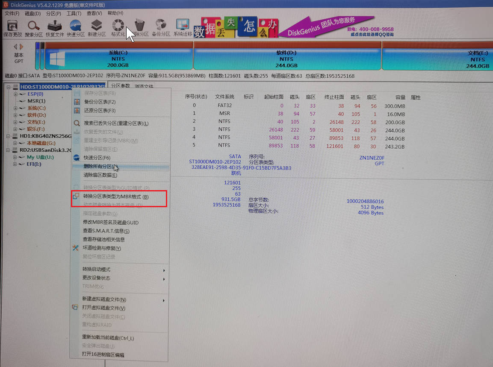
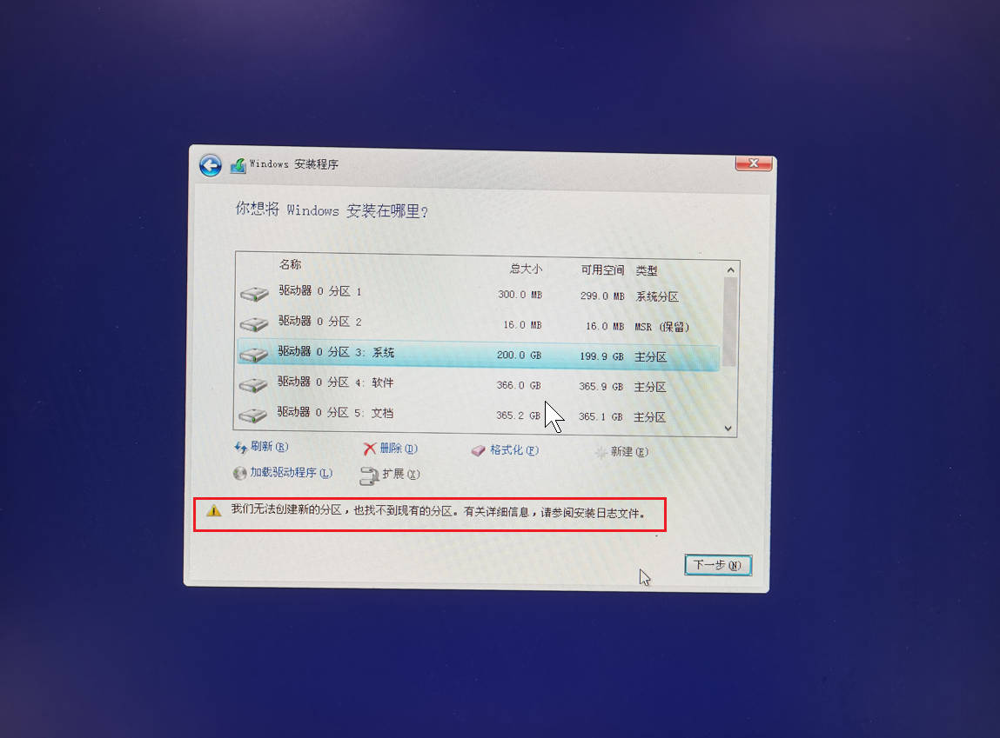
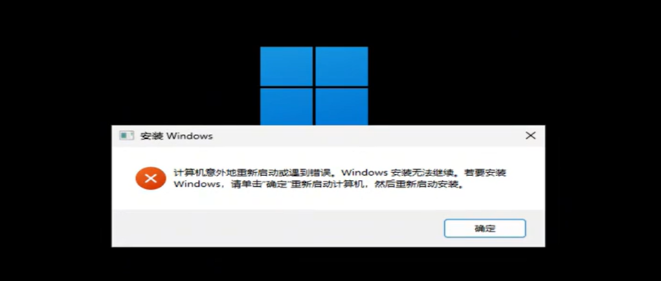
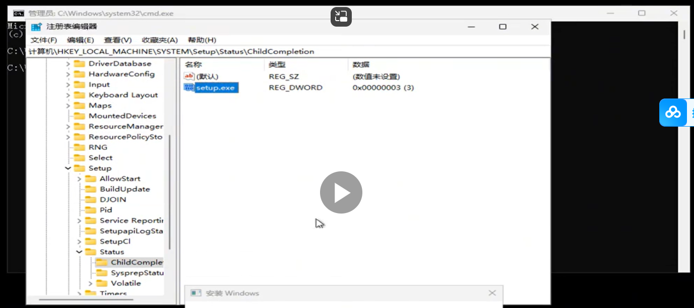

# 重装系统

## 认识基本知识

1.  装系统的本质：运行在U盘内存放好的windows镜像
2.  安装系统的方法：第一种：微软官方ISO镜像文件直接写入；第二种：PE便携式操作系统辅助安装写入（PE (Preinstallation Environment, 预安装环境)）。


3.  U盘格式化的方式：FAT32：单个分区不能超过32G，单个文件不能超过4G。exFAT和NTFS：老旧主板和老旧电脑无法识别。


4.  磁盘分区格式和启动引导：开机引导方式：Legacy引导、UEFI引导；存储数据的结构：MBR分区、GPT分区；MBR分区要用Legacy引导，GPT分区的要用UEFI引导。

## 第一种：微软官方ISO镜像文件直接写入

1.  下载系统安装文件进U盘

```
百度搜索微软官网下载win10
下载win10启动盘制作工具
打开win10启动盘制作工具
接受许可条款
选择为另一台电脑创建安装介质（U盘、DVD或ISO文件）
选择U盘（ISO文件就是单纯下载安装包）
加载中，U盘被格式化为FAT32格式
U盘有了win10的安装文件（安装系统时文件必须放在根目录下）
```

2.  正式安装

```
进入BIOS画面（按开机按钮并不断按delete键（不同电脑不一样，可能是F2、F10、F12）;可以修改语言为中文；把UEFI引导的U盘放置于第一启动项，优先于磁盘本身启动；选择Exit选项卡下的Save Change & Rest（即保存并重启电脑））
进入安装流程（下一步；下一步；删除分区；新建分区；选择C盘；（有可能会报错，那么刷新；新建分区；选择C盘）；下一步；加载中：写入系统；10秒后重启；拔掉U盘;Win10初始化界面（自由选择；等待几分钟））
调出我的电脑和控制面板（桌面右键，个性化，主题，桌面图标设置，勾选计算机，控制面板，确定）
装驱动
```

3.  BIOS的高级模式：

```
Boot选项卡下的Boot Option #1选择为UEFI引导的U盘；
Exit选项卡下的Save Change & Rest（即保存并重启电脑）
```

4.  转换分区表类型

```
报错：Windows无法安装到这个磁盘。选中的磁盘采用MBR分区表。在EFI系统上，windows只能安装到GPT磁盘。

方法1.转硬盘格式
在当前安装界面按住【Shift】+【F10】调出命令提示符窗口；
输入【diskpart】，按回车执行;
进入DISKPART命令模式，输入【list disk】回车，列出当前磁盘信息；
要转换磁盘0格式，则输入【select disk 0】回车，输入【clean】，删除磁盘分区；
输入【convert gpt】则转为GPT；或者输入【convert MBR】 转换为 MBR格式；
最后输入两次 【exit】 回车退出命令提示符，返回安装界面继续安装系统。
```



## 第二种：PE便携式操作系统辅助安装写入

1.  微PE制作

```
百度搜索微PE进入微PE官网
下载：微PE工具箱V2.0 64位
打开微PE安装包，安装进U盘内
U盘被分成两个分区
下载win10的ISO文件
```

2.  MSDN下载纯净版ISO镜像文件

```
检验文件完整性：哈希值
IHasher计算哈希值
```

3.  安装步骤

```
进入BIOS画面（按开机按钮并不断按delete键，不同电脑不一样，可能是F2、F10、F12）；把UEFI引导的U盘放置于第一启动项，优先于磁盘本身启动，保存并退出 
进入微PE桌面，打开分区工具，快速分区（注意对齐分区到此扇区的整数倍、转换分区表类型为GUID格式）
自备网卡驱动或是驱动精灵装网卡驱动、其它驱动
调出我的电脑和控制面板（个性化，主题，桌面图标设置）
```










## 安装中间中断出错以及解决





Shift+f10；regedit；